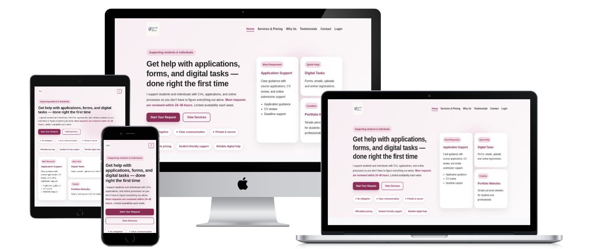

# We Code We Sketch

We Code We Sketch is a full-stack web application providing digital support and application assistance for students and individuals in Ireland and worldwide.

The website provides clear information about services such as CV support, application guidance, digital task assistance, and simple portfolio website support. It also gives visitors an easy way to make enquiries through a contact form or WhatsApp.

## Live Site
[](https://www.wecodewesketch.com/)




## Project Purpose

The purpose of this project is to establish a professional digital presence for We Code We Sketch and provide users with a clear, accessible way to understand services, view pricing, read testimonials, and request support.


## Project Highlights

- Designed and developed a full-stack Django application
- Implemented custom domain handling with automatic redirection
- Built a user-friendly contact system with WhatsApp integration
- Focused on real-world usability and client conversion
- Created a responsive and accessible UI for all devices
- Designed with a strong focus on emotional clarity, accessibility, and user trust
  
## Key Features

- Responsive homepage with clear service messaging
- Structured services and pricing system
- Contact form with backend handling (Django)
- Floating WhatsApp button with pre-filled message
- Testimonials section for social proof
- Admin-only login system for managing requests
- Custom domain configuration with `.ie` → `.com` redirect
- Mobile-first responsive design

## Target Users

This website is designed for:

- Students applying for courses
- Individuals needing CV support
- People who need help with online forms or digital tasks
- Clients looking for simple portfolio website support
- Users in Ireland and worldwide

## Technologies Used

### Frontend
- HTML5
- CSS3
- JavaScript

### Backend
- Python
- Django

### Deployment & Tools
- Heroku (Deployment)
- Whitenoise (Static file handling)
- PostgreSQL (Production database)
- SQLite (Development database)

## Pages

### Home

Introduces the business, explains the support process, highlights trust points, and includes testimonials.

### Services & Pricing

Shows available service packages and pricing clearly.

### Contact

Allows users to submit a support request or contact through WhatsApp.

### Admin Login

Restricted login page for site administration only.

## Deployment

The project is deployed on Heroku and uses a custom domain:

```text
https://www.wecodewesketch.com/
```

The Irish domain also redirects correctly:
```text
https://wecodewesketch.ie
https://www.wecodewesketch.ie
```

### Local Development

To run the project locally:
```bash
python manage.py runserver
```

Then open in your browser:
```bash
Then open: [http://127.0.0.1:8000/](http://127.0.0.1:8000/)
```

## Future Improvements

- Add dynamic testimonials managed via admin dashboard
- Implement analytics to track user behaviour
- Improve form validation and user feedback
- Expand service offerings and automation

### Business Contact

- Website: www.wecodewesketch.com
- Instagram: @wecodewesketch
- Linktree: linktr.ee/wecodewesketch

### Author

Created and maintained by Forest Eloghosa.

### Status

Live and actively maintained.
